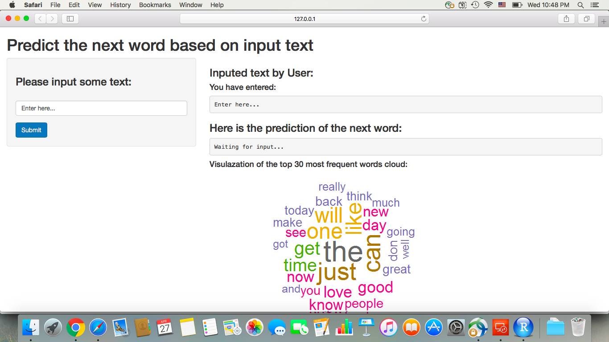

## My Capstone App for Data Science Course
### Predicting the next word based on Input

Author: Gabby

Date: April 26th, 2016

---

### Predicting the next word based on Input

Introduction

1. The purpose of this app is to predict the next word based on the input text.
2. The prediction algorithm behind this app is essentially an N-gram language model, which is derived with data from Swiftkey.
3. How to use the app: User could input text (multiple words), then click submit buttion; the app will predict the next word by showing 3 possible results with decreasing probability.

---

### SwiftKey data analysis

Data summary

1. Three datasets contain information from blogs, news and twitter of Swiftkey database are cleaned (by removing extotic characters, numbers, punctuation and profanity) and then analyzed to understand the frequency of word and word pairs.
2. The datasets are farely large, with each ranging from 160 to 200 mb; on average, there are 10 to 40 words per line in these datasets. 
3. Due to the memory capacity constraint on my computer, only 40% randomly sampled data is used to train the model and the rest is kept as testing data.

--- 

### Modeling methodology and algorithm
N-gram language model, stupid backoff inplementation and Kneser-Ney smoothing

1. Build basic 1-gram, 2-gram, 3-gram and 4-gram models (with the cleaned sub-dataset) for predicting the next word based on the previous 1, 2, or 3 words.
2. Build the final model to handel unseen N-grams, by using stupid backoff implementation: starting with 4-gram, use the last three entered words to predict the next one; if no 4-gram found, backoff to 3-gram; if no 3-gram found then backoff to 2-gram; if no 2-gram found backoff to unigram.
3. Finally, Kneser-Ney smoothing method is applied to discount the probability of lower order gram models during the backoff implementation.

---

### CapstoneApp overview
Screenshot of the App

  

 

